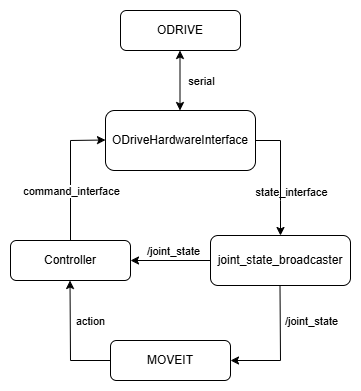

# MOVEIT_R6BOT

moveit应用在ros2_control_demo上，同时留了odrive接口
- 启动moveit以及仿真
```
ros2 launch ctrl_rbot moveit_controller.launch.py 
```
- 启动发送目标位姿节点
```
ros2 run ctrl_rbot ctrl_rbot_node  
```

## 一、项目流程图与效果

|流程图|
|:-:|
||

|planning|
|:-:|
||

|excuting|
|:-:|
||

## 二、需提供的文件及功能

### 1、Hardwareinterface
- 使用Hardwareinterface需要提供一个plugin.xml用于告诉ros2_control接口的名称
- 如使用r6bot仿真的硬件接口

```
<library path="ctrl_rbot">
  <class name="ctrl_rbot/RobotSystem"
         type="ctrl_rbot::RobotSystem"
         base_class_type="hardware_interface::SystemInterface">
    <description>
      Robot hardware plugin for 6 dof robot tutorial.
    </description>
  </class>
```
### 2、Controller
#### 2.1、Controller URDF
controller需要一个机器人自身的urdf声明各个link与joint的关系，同时需要一个.ros2_control.xacro用于声明接口参数，最后一般会将这几个urdf合并成一个机器人的urdf.xacro，以下介绍.ros2_control.xacro中的声明
##### 2.1.1、<ros2_control name="${name}" type=" ">
这个代码用于声明这个ros2_control的名字和类型，类型包含三种标签 "system" "actuator" "sensor"

- <ros2_control name="${name}" type="system"> 表示复杂系统，包含多个执行器与传感器，可同时提供command_interfaces和state_interfaces
- <ros2_control name="${name}" type="actuator"> 表示独立的执行器，通常只表示单个joint，必须提供command_interfaces，可选提供state_interfaces
- <ros2_control name="${name}" type="sensor"> 表示独立的传感器，只能提供state_interfaces
##### 2.1.2、hardware
- 上文提到的硬件接口需要在此xacro中声明
```
<hardware>
    <plugin>ctrl_rbot/RobotSystem</plugin>
</hardware>
```
##### 2.1.3、 tag groups
- joint-tag groups 表示机器人的关节，可同时提供command_interfaces和state_interfaces
- sensor-tag groups 表示传感器，只能提供state_interfaces
- gpio-tag groups 表示GPIO引脚，可同时提供command_interfaces和state_interfaces

#### 2.2、Controller YAML
joint_state_broadcaster和controller都在该yaml下声明。
- 如果有自定义的controller需要在plugin.xml下声明，才可在yaml中使用。
```
  <class name="ctrl_rbot/RobotController"
         type="ctrl_rbot::RobotController"
         base_class_type="controller_interface::ControllerInterface">
    <description>
      Robot controller plugin for 6 dof robot tutorial.
    </description>
  </class>
```
- 如果不同的joint的command_interfaces和state_interfaces不同，需要在yaml中分别定义controller

### 3、Moveit
moveit的配置文件需要专门新建一个moveit_config结尾的功能包来存放，launch中加载moveitconofig时会自动寻找moveit_config结尾的功能包
```
moveit_config = (
        MoveItConfigsBuilder("ctrl_r6bot") )
```
#### 3.1、 SRDF与URDF
urdf.xacro与ros2_control的相同即可，moveit在需要机器人的urdf.xacro的同时也需要一个.srdf文件用于声明运动组
- 首先是定义关节组的名字和这个组是从哪个关节到哪个关节
```
<group name="">
  <chain base_link="" tip_link=""/>
</group>
```
- "<virtual_joint>" 定义虚拟关节，把机器人固定在世界坐标系下
- "<end_effector>" 声明末端执行器
- "<group_state>" 定义运动组的预设状态，moveit可以直接使用这些预设状态，比如定义一个每个joint的value都是0的初始角度或位置（根据关节是revolute还是prismatic决定）的state为"home",moveit可以直接使用"home"
- "<disable_collisions>" 管理碰撞检测

#### 3.2、 Moveit YAML
- moveit_controllers.yaml 使用方法与ros2_control的类似，并且controller的名字要与ros2_control的yaml相同
- joint_limits.yaml 关节限幅参数，缺少该yaml moveit会报错
- kinematics.yaml IK求解器参数，本项目使用默认kdl_kinematics_plugin/KDLKinematicsPlugin

| 插件名称                     | 插件路径                                                   | 
|------------------------------|----------------------------------------------------------|
| KDL                          |`kdl_kinematics_plugin/KDLKinematicsPlugin`               | 
| IKFast                       | `ikfast_kinematics_plugin/IKFastKinematicsPlugin`        | 
| TracIK                       | `trac_ik_kinematics_plugin/TRAC_IKKinematicsPlugin`      | 
| OPW IK                       | `opw_kinematics_plugin/OPWKinematicsPlugin`              | 

- 规划插件 使用不同的算法需不同的yaml，本项目使用默认的ompl插件

| 规划器插件名称                                          | 
|--------------------------------------------------------|
| `ompl_interface/OMPLPlanner`                           | 
| `chomp_interface/CHOMPPlanner`                         | 
| `stomp_interface/STOMPPlanner`                         | 
| `pilz_industrial_motion_planner/CommandPlanner`        | 

launch中可同时注册多个规划器插件
```
.planning_pipelines(
    pipelines=["ompl", "chomp", "pilz_industrial_motion_planner"]
        )
```
